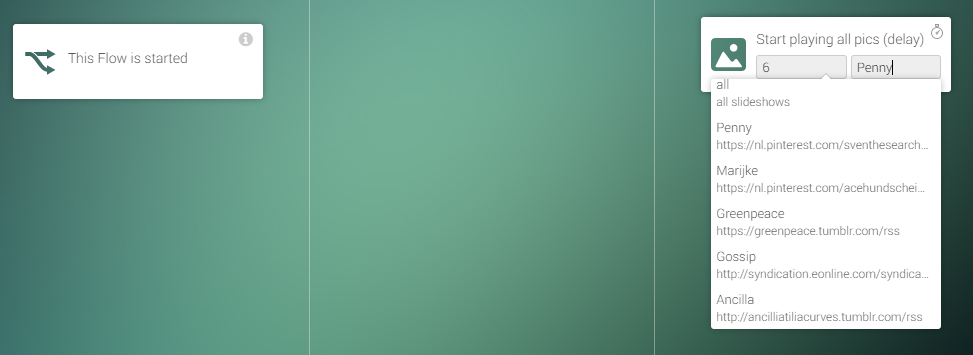
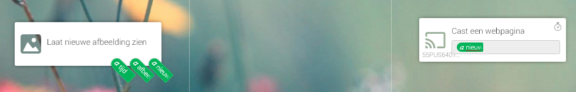
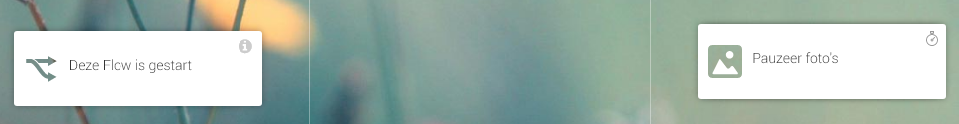

# Slideshow
Show a slideshow on your chromecast 
(only https-urls)

## Usage
Start playing  

Show picture  

Stop playing  

## examples to use  
https://www.pinterest.co.uk/gabydmxx/the-big-bang-theory.rss/  
https://nl.pinterest.com/sventhesearcher/kaley-cuoco.rss/  
https://nl.pinterest.com/hoefhoef/btvs.rss/   

## to do:
* add more pics, **never enough !**  
use normal URL's too
<strike>* use more then 25 pics per board</strike>
* enable trigger for new submissions

## Changelog
v0.1.0 (30-11-2017) first version  
v0.1.6 (04-12-2017) Changed images and icon